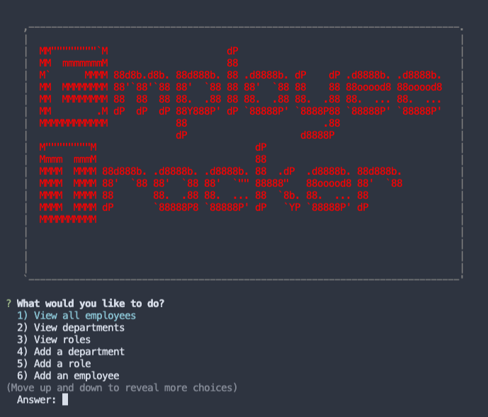

# Note Taker App 12_MySQL

[](https://opensource.org/licenses/MIT)

## Description

## Table of Contents

- [Installation](#installation)
- [User Story](#User-Story)
- [Mock-Up](#Mock-up)
- [Acceptance Criteria](#acceptance-criteria)
- [Guidelines](#guidelines)
- [License](#license)
- [Contribute](#contribute)

## Installation

Use the following command to install the dependencies.

    npm install

## User Story

```
As a business owner
I want to be able to view and manage the departments, roles, and employees in my company
So that I can organize and plan my business
```

## Mock-Up

The following image shows a the "Home Page" in the console after running "npm start":



Using this schema:


Running the program:


## Acceptance Criteria

```
Build a command-line application that at a minimum allows the user to:

  * Add departments, roles, employees

  * View departments, roles, employees

  * Update employee roles

```

## Guidelines

- Use the [MySQL](https://www.npmjs.com/package/mysql) NPM package to connect to MySQL database and perform queries.

- Use [InquirerJs](https://www.npmjs.com/package/inquirer/v/0.2.3) NPM package to interact with the user via the command-line.

- Use [console.table](https://www.npmjs.com/package/console.table) to print MySQL rows to the console. A cleaner version of the built in `console.table();`

---

## License

Licensed under the [MIT](https://choosealicense.com/licenses/mit/)

    MIT License

    Copyright (c) [2021] [Connor Gannaway]

    Permission is hereby granted, free of charge, to any person obtaining a copy
    of this software and associated documentation files (the "Software"), to deal
    in the Software without restriction, including without limitation the rights
    to use, copy, modify, merge, publish, distribute, sublicense, and/or sell
    copies of the Software, and to permit persons to whom the Software is
    furnished to do so, subject to the following conditions:

    The above copyright notice and this permission notice shall be included in all
    copies or substantial portions of the Software.

    THE SOFTWARE IS PROVIDED "AS IS", WITHOUT WARRANTY OF ANY KIND, EXPRESS OR
    IMPLIED, INCLUDING BUT NOT LIMITED TO THE WARRANTIES OF MERCHANTABILITY,
    FITNESS FOR A PARTICULAR PURPOSE AND NONINFRINGEMENT. IN NO EVENT SHALL THE
    AUTHORS OR COPYRIGHT HOLDERS BE LIABLE FOR ANY CLAIM, DAMAGES OR OTHER
    LIABILITY, WHETHER IN AN ACTION OF CONTRACT, TORT OR OTHERWISE, ARISING FROM,
    OUT OF OR IN CONNECTION WITH THE SOFTWARE OR THE USE OR OTHER DEALINGS IN THE
    SOFTWARE.

## Contribute

[](code_of_conduct.md)

Please give me credit! This is not an original idea but an original way to create this.

## Tests

This application has no tests

## Questions

If you have any questions regarding this application please contact me at my GitHub here: (github.com/gannacon)

Or Send me an email: cwgannaway@gmail.com

---

© 2021 Connor Gannaway. All Rights Reserved.
